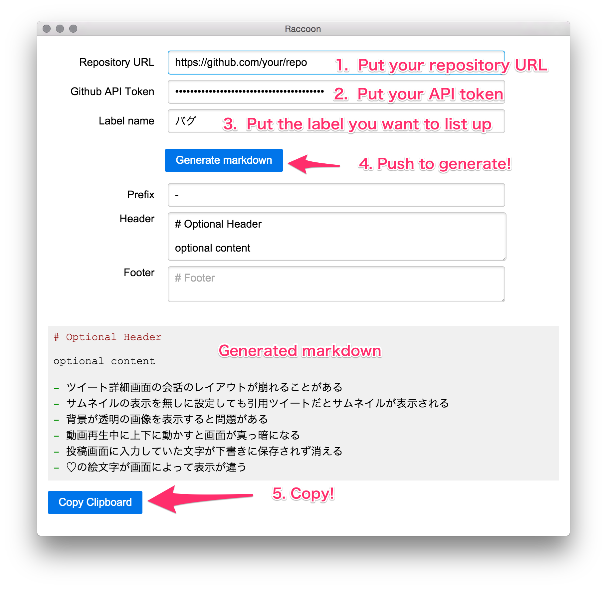

# Raccoon

GitHub で管理している任意のリポジトリにある issue の中で指定したラベルが付いているものだけをリストアップして Markdown に整形するあぷり。

以下の様なワークフローで bug 一覧や追加予定の機能(roadmap)のラベルがついた issue をリストアップして
Markdown を生成し任意の web ページに貼り付けるだけでユーザに情報を公開することを目的としている。

1. リストアップしたい issue に特定の label を付ける
  - bug や roadmap など
2. Raccoon を使って Markdown を生成
3. どこかに貼り付けてユーザーに公開

CLI と GUI を提供しているので自動化もできるし非エンジニアでも簡単に使えるようにしている。

## Install 方法

パッケージ化とかはしてないので普通の nodejs のアプリとして動作させる必要がある。

TOOD: パッケージ化

```sh
git clone git@github.com:covelline/raccoon.git
cd raccoon/raccoon_cli
npm install
cd ../
npm install

# Run GUI Raccoon
npm start
```

## Raccoon CLI

[See: raccoon_cli/README.md](raccoon_cli/README.md)

## Raccoon GUI

便利な UI を持った画面を提供。 入力したフォームの値は次回起動時に復元されます。



### 使い方

1. Repository URL、 Github API Token, Label name を埋める。
2. Generate markdown ボタンを押す
3. Prefix, Header, Footer を必要に応じていじる
4. Copy Clipboard でコピーする
5. どっかに貼り付ける

